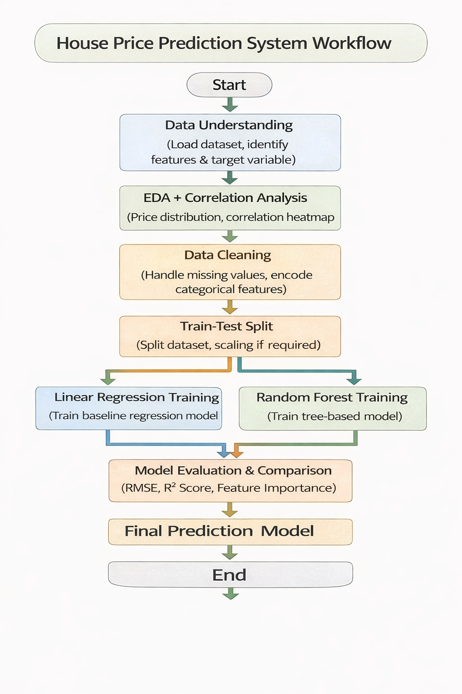

#  HOUSE PRICE PREDICTION - MACHINE LEARNING PROJECT

## LIVE DEMO :
[https://housepricepredictor2026.streamlit.app/](https://house-price-predictor-ana5.streamlit.app/)

---

##  PROJECT OVERVIEW

This project predicts the selling price of a house based on various features such as area, number of bedrooms, bathrooms, location, and amenities.

It is a **Supervised Machine Learning Regression Problem** because:

 The dataset contains labeled values (SalePrice)
 The output is a continuous numerical value

The goal is to build a reliable model that can estimate property prices accurately for unseen data.

---

##  OBJECTIVES

 Understand housing dataset
 
 Clean and preprocess data
 
 Engineer useful features
 
 Train multiple regression models
 
 Evaluate performance using proper metrics
 
 Select the best model for prediction

---

## PROBLEM STATEMENT

In the real estate industry, accurately determining the price of a house is a challenging task. Property prices are often estimated based on manual judgment, market assumptions, or limited comparisons, which can lead to incorrect pricing decisions.

Without a data-driven pricing system:

Houses may be overpriced or underpriced

Buyers struggle to evaluate fair property value

Real estate agencies face difficulty in decision making

The goal of this project is:

**To predict house selling prices based on property characteristics using supervised machine learning techniques**.

By building a house price prediction model, stakeholders can:

--> Estimate accurate market value of properties
--> Support data-driven real estate decisions
--> Help buyers and sellers make informed pricing choices
--> Improve efficiency in property valuation

---

##  DATASET USED

The project uses three files:

| File                  | Purpose                      |
| --------------------- | ---------------------------- |
| train.csv             | Used to train the model      |
| test.csv              | Used to predict house prices |

**Target Column:** SalePrice

**Features include:**

 Living Area (square feet)
 
 Bedrooms
 
 Bathrooms
 
 Location

 House Age
 
 Garage capavity

 Overall Quality

 Basement Area(square feet)

---

##  PROJECT APPROACH

The project begins with understanding and exploring the housing dataset using Exploratory Data Analysis to identify important features affecting house prices. Data preprocessing is performed by handling missing values and encoding categorical variables. The dataset is then split into training and testing sets. Linear Regression and Random Forest models are trained to predict house prices, and their performance is evaluated using RMSE and R² score. The best-performing model is selected to generate accurate house price predictions.

---

## BLOCK DIAGRAM

  
   
  <em>Figure: House Price Prediction Block Diagram</em>

